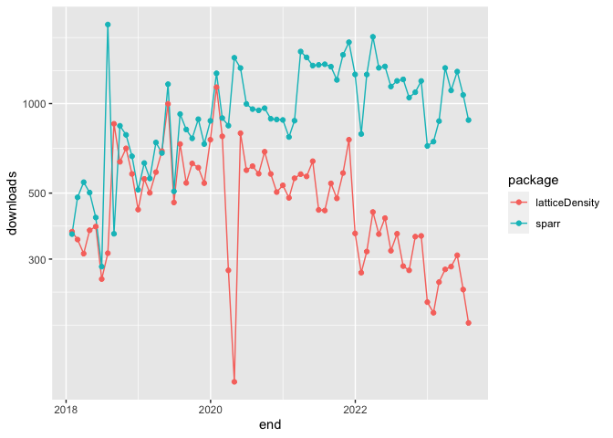

<!-- README.md is generated from README.Rmd. Please edit that file -->

# densityLocPoly

<!-- badges: start -->
<!-- badges: end -->

This package is designed to estimate bivariate densities using
nonparametric local polynomial procedures using data that belong to
(complicated) domains. Examples can be found in the subdirectory
`examples/` of the package.

## Installation

You can install the development version of densityLocPoly from
[GitHub](https://github.com/) with:

``` r
# install.packages("devtools")
devtools::install_github("klutchnikoff/densityLocPoly")
```

## Examples

## Comparison with `sparr`

``` r
library("ggplot2")

x <- dlstats::cran_stats(c("latticeDensity", "sparr"))

if (!is.null(x)) {
  ggplot(x, aes(end, downloads, group = package, color = package)) +
    geom_line() +
    geom_point() +
    scale_y_log10()
}
```


